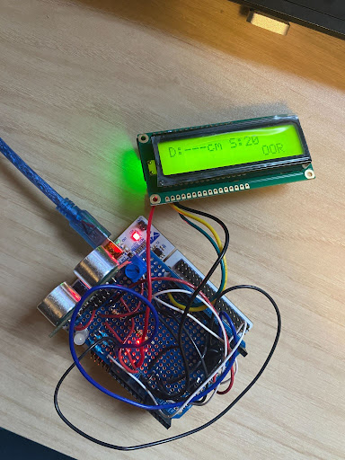
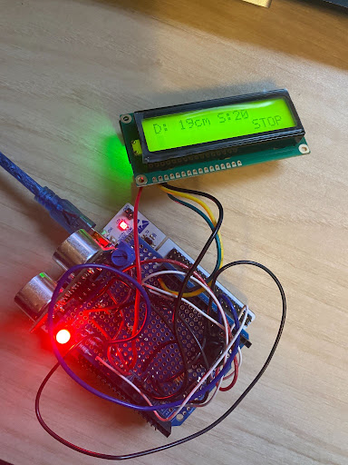
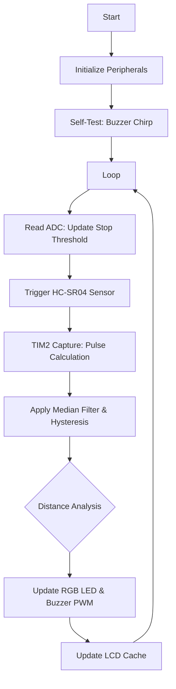

# STM32 Ultrasonic Parking Assistant
**Author:** Joseph Pokuta

**Course:** Embedded Microcontrollers (EE3174) | Michigan Technological University

**Date:** 12/03/25

This project implements a real-time distance-sensing parking aid designed for the STM32L152RE (ARM Cortex-M3) platform. The system provides immediate visual and auditory feedback to assist drivers in obstructed or low-visibility environments. It was developed as a complete embedded solution, spanning from initial KiCad schematic design to a hand-soldered hardware prototype.

Uses buzzers, lights, an LCD screen, and an ultrasonic sensor to provide a simple yet effective reverse-parking assistant.

*This project was completed for my Embedded Microcontrollers class at Michigan Tech. Be aware that the project files are named with 'EE3174' and 'JP' exactly how they were submitted for the class.*

## System Capabilities
* **Dynamic Range Calibration:** A 10k potentiometer is polled via ADC1 to set the "STOP" distance threshold (20cm - 150cm) in real time.
* **Signal Conditioning:** Implements a median-of-3 filter to eliminate ultrasonic sensor noise and software hysteresis to prevent LED/LCD flickering at band boundaries.
* **Contextual User Interface:** A single interrupt-driven button supports short-press (Mute) and long-press (System Enable/Disable) actions.
* **Non-Blocking Logic:** The buzzer PWM and LCD I2C updates are managed via state-machine logic to ensure the system remains responsive without utilizing CPU-halting delays.

| State | Visual | Description |
| :--- | :--- | :--- |
| **Out of Range (OOR)** |  | Active when objects are >60cm away. The system enters a low-activity state to prevent needless power draw and noise. |
| **Optimal Stop** |  | Indicates the vehicle has reached the precise "Stop" distance (e.g., 20cm) as calibrated by the user via the potentiometer. |

## Hardware Spec
The hardware was designed in KiCad and hand-soldered onto a protoboard shield.

[View Full Hardware Schematic and Layout (PDF)](Media/project_layout.jpg)

### Pin Mapping
| Peripheral | STM32 Pin | Mode | Purpose |
| :--- | :--- | :--- | :--- |
| **HC-SR04 Echo** | PA0 | TIM2 Input Capture | Measures pulse width for distance calculation |
| **HC-SR04 Trig** | PA9 | GPIO Output | Generates 12us trigger pulse |
| **I2C LCD** | PB8 / PB9 | I2C1 | Interface for MCP23008 Port Expander |
| **RGB LED** | PB13 - PB15 | GPIO Output | Tri-color visual proximity indicator |
| **Buzzer** | PB4 | TIM3 CH1 (PWM) | Variable frequency audio feedback |
| **Potentiometer** | PA4 | ADC1 | Real-time "Stop" threshold calibration |
| **User Button** | PA8 | EXTI (Interrupt) | Short press: Mute / Long press: Power |

### Bill of Materials
* 1x STM32L152RE Nucleo-64
* 1x HC-SR04 Ultrasonic Sensor
* 1x 16x2 Character LCD (I2C)
* 1x Common-Anode RGB LED
* 1x Piezo Buzzer
* 1x 10k Ohm Potentiometer
* 1x Momentary Tactile Switch
* 1x Protoboard Shield

## Challenges and Debugging
The transition from schematic to a soldered prototype involved significant hardware troubleshooting:
* **Voltage Rail Optimization:** Initial smoke testing revealed that the HC-SR04 and I2C LCD were underperforming on the 3.3V rail. The power domain was shifted to 5V while maintaining logic compatibility with the STM32's 5V-tolerant pins, resulting in stable sensor pings and clear LCD contrast.
* **Hardware Isolation:** A grounding failure on the piezo buzzer was identified late in the assembly phase. By isolating the buzzer subsystem and performing continuity tests, the fault was traced to a cold solder joint on the common ground plane and rectified.
* **OOR Logic:** Specialized handling was implemented for Out-of-Range measurements to prevent the system from reporting "ghost" distances or running the UI unnecessarily when the path is clear.

### Logic Flow

## How to Run

### Hardware
* Wire the components according the to **Pin Mapping** table and the KiCad schematic `project_layout.jpg`
* Connect the STM32 Nucleo-64 board via Mini-USB to your device

### Software
* Open **STM32CubeIDE**.
* Import the project from the `/final_parkingAssistant_JP` directory.
* Open the `.ioc` file to verify the Clock Configuration (ensure the HCLK is set correctly for the Timer prescalers).
* Build the project to generate the `.elf` or `.bin` file.
* Connect your Nucleo board and click **Run** to flash the firmware.

### Usage
* Upon startup, the system will perform a short buzzer "chirp" to confirm the PWM and Piezo are functional.
* Adjust the **Potentiometer** to set your desired stopping distance.
* Use the **Button** to toggle the mute state ('M') or long-press to enter standby mode.
